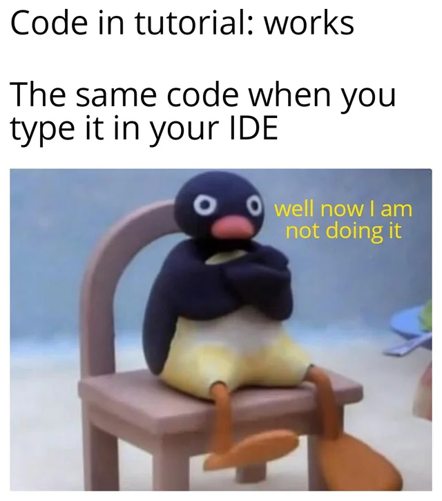
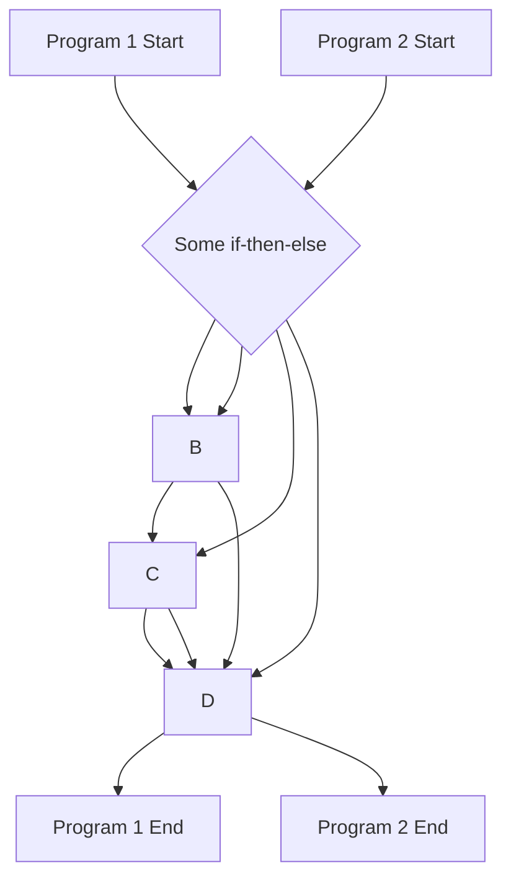

# Milestone 02: Becoming Friends with C#

Good news, the wait is over. You will now write your first C# code. 🥳

But, before we dive into the conception and implementation of our banking application, we will do some simple C# exercises first. The exercises are designed to specifically prepare you for the implementation of the banking app.



The objectives of this milestone are:

- Getting used to the C# syntax
- Learn how to use basic data types and structures
- Use loops and if-then-else constructs
- Create your first classes and objects
- Ask the user for input and parse it

## Task 02.1: Working with Different Data Types

Have a look at the Program.cs in the template/task02-1 folder. This is the entry point for the following tasks. A few versions ago, so called [Top-Level Statements](https://learn.microsoft.com/en-us/dotnet/csharp/whats-new/tutorials/top-level-statements) were added to C#. They allow you to write your C# statements directly into an empty .cs file and run it without any additional boilerplate code. As you can see, in the top of the file there is the C# statement

```csharp
Console.WriteLine("Hm, doesn't look that difficult.");
```

which prints the string

```
"Hm, doesn't look that difficult."
```

and a view output messages to your console when the program is executed. Go ahead and execute the program to make sure that everything works.

Below this line, you will find exercises for you to solve. Remember that you can always consult the resources mentioned in the [README file](../README.md) if you are stuck. Try to solve the exercises yourself first before looking at the solutions (This is really important!).

Enjoy making your first steps in C#! 🥳

## Task 02.2: Loops and if-then-else Constructs

So far, you have used basic data types, invoked some methods on them, and read some of their properties. Did you notice that the program you wrote was executed in a linear fashion? Now, we will add loops and if-then-else constructs to the mix to steer the control flow of our program.



Solve the exercises in the Program.cs file in the templates/task02-2 folder.

## Task 02.3: Creating your own Classes and Objects

Congratulations, you know the basic building blocks to control the flow of your C# program. And without thinking about, you actually already used t

## Task 02.4: Processing User Input

