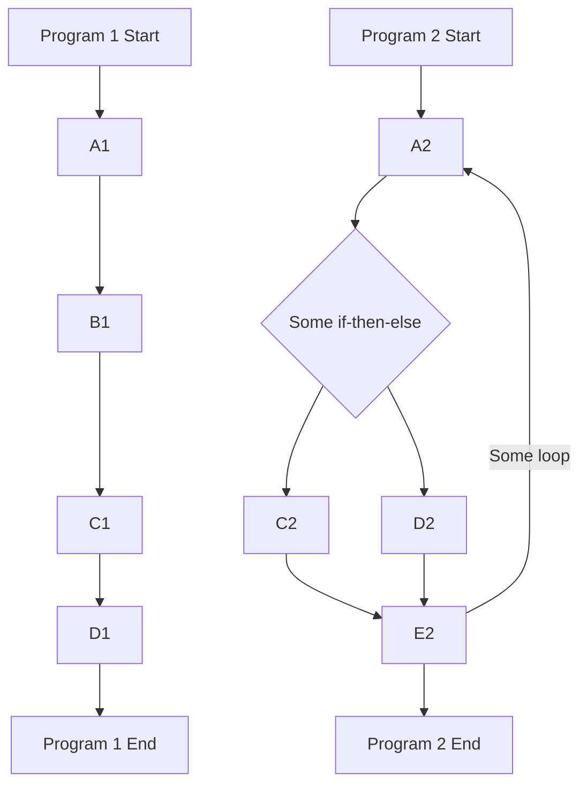
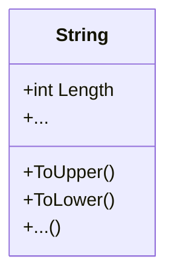

# Milestone 02: Becoming Friends with C#

Good news, the wait is over. You will now write your first C# code. 🥳

But, before we dive into the conception and implementation of our banking application, we will do some simple C# exercises first. The exercises are designed to specifically prepare you for the implementation of the banking app.


The objectives of this milestone are:

- Getting used to the C# syntax
- Learn how to use basic data types and structures
- Use loops and if-then-else constructs
- Create your first classes and objects
- Ask the user for input and parse it

## Task 02.1: Working with Different Data Types

Have a look at the Program.cs in the template/task02-1 folder. This is the entry point for the following tasks. A few versions ago, so called [Top-Level Statements](https://learn.microsoft.com/en-us/dotnet/csharp/whats-new/tutorials/top-level-statements) were added to C#. They allow you to write your C# statements directly into an empty .cs file and run it without any additional boilerplate code. As you can see, in the top of the file there is the C# statement

```csharp
Console.WriteLine("Hm, doesn't look that difficult.");
```

which prints the string

```
"Hm, doesn't look that difficult."
```

and a view output messages to your console when the program is executed. Go ahead and execute the program to make sure that everything works.

Below this line, you will find exercises for you to solve. Remember that you can always consult the resources mentioned in the [README file](../README.md) if you are stuck. Try to solve the exercises yourself first before looking at the solutions (This is really important!).

Enjoy making your first steps in C#! 🥳

## Task 02.2: Loops and if-then-else Constructs

So far, you have used basic data types, invoked some methods on them, and read some of their properties. Did you notice that the program you wrote was executed in a linear fashion like _Program 1_ below? Now, we will add loops and if-then-else constructs to the mix to steer the control flow resulting in more complex control flows like _Program 2_ below.



Solve the exercises in the Program.cs file in the templates/task02-2 folder.

## Task 02.3: Creating your own Classes and Objects

Congratulations, you know the basic building blocks to control the flow of your C# program. And without thinking about it, you actually already used object-oriented programming. Every time you declared a variable and set its value you created an object, i.e. an instance of class specified as the type.

For instance,

```csharp
string myString = "This is my string!";
```

instantiates an object of the [String class](https://learn.microsoft.com/en-us/dotnet/api/system.string?view=net-7.0) with `myString` as the name of the variable. Classes possess properties, and methods. This is the reason why you can access properties like `Length` or call methods like `ToUpper()` of the String instance `myString`. Using a UML class diagram, we could visualize the (simplified) String class as follows:



Next up, you will create your own classes and instantiate to access their properties and call their methods. Solve the exercises in the Program.cs file in the templates/task02-3 folder.

## Task 02.4: Processing User Input

Wow, even writing your own classes does not seem to be a problem for you. 😉

You are now in the final task of this milestone. Here, you will learn how to ask a user for input during the execution of a program via the command line and how to parse the input, effectively implementing a [CLI (Command-Line Interface)](https://en.wikipedia.org/wiki/Command-line_interface).

The exercises of this task will guide you through the implementation of a CLI that allows a user to input two numbers and perform calculations on them, as depicted in the UML Activity Diagram below. Solve the exercises in the Program.cs file in the templates/task02-4 folder.

```mermaid
    flowchart TD
        Start(( ))-->A(Ask user what they want to do)
        A-->B{ }
        B-->|Add|C(Ask for the two numbers)
        B-->|Subtract|D(Ask for the two numbers)
        C-->E(Add the two numbers)
        D-->F(Subtract the second from the first number)
        E-->G(Display the result)
        F-->G
        G-->A
        B-->|Exit|H(Quit the program)
        H-->Finish((( )))
 ```

When you have finished this task, you can move on to Milestone 02 where we will conceptualize your banking application! 🚀
