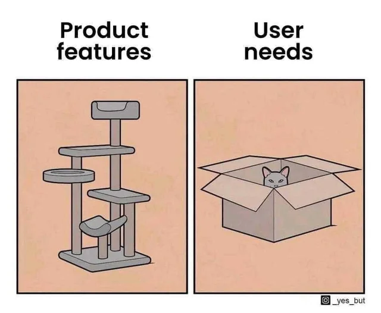

# Milestone 01: Setting the Scope

So, you are now ready to implement your first C# app? Alright, then let's do this!

As said before, we will implement a small prototypical banking app that allows a user to perform common tasks. In this milestone, we conceptualize our application using UML diagrams, a typical tool in information systems and software engineering. UML diagrams allow us to make our ideas explicit, thus providing a useful reference throughout the development. 🔍

Hence, the objectives of this milestone are:

- Becoming familiar with different types of UML diagrams
- Making the concept of an application explicit using UML diagrams
- Creating different UML diagrams yourself
- Learning the basic concept of object-oriented programming

Remember that you can always compare your results with the solutions provided in the milestone's solution folder. You can even use the solutions for one task as the starting point for the next one (which is generally recommended if you are a beginner and have no instructor guiding you through this course).

## Task 01-1: A Use Case Diagram

Your first task is to think about the concrete use cases that a banking application should provide. In the course of this course (😉), we will try to implement an application serving these use cases. Of course, you can scale this thing up as big as you want but we would recommend to limit yourself to three to five basic use cases.

When you are ready, prepare a [UML Use Case Diagram](https://en.wikipedia.org/wiki/Use_case_diagram) visualizing your use cases. To keep it simple, assume that there is only one actor, i.e. the user of the application.

## Task 01-2: Activity Diagrams

Now that our use cases are set, we have to think about how we can translate these use cases into software. More concretely, we have to think about the steps required to serve the individual use cases. For this purpose, we will leverage [UML Activity Diagrams](https://en.wikipedia.org/wiki/Activity_diagram). Add steps whenever data is retrieved, the user enters data, data is displayed, and so on.

Select three of your use cases and prepare an activity diagram for them. You can draw a single diagram or try to combine them into one. Preparing a diagram/diagrams for three of your use case should suffice for now. If you need more details for the remaining use cases later on, you can always come back revise your diagram(s).

## Task 01-3: A Class Diagram

Have a look at your activity diagram(s). Can you find similar steps in the workflow of different use cases? That's great because it means we can create a software component that performs this step and reuse it in the implementation of both of them!

Think about your C# application as a factory where machines perform certain tasks to create a certain thing. When you build a factory, you have to order the correct machines.

C# is an object-oriented programming language. In [object-oriented programming](https://en.wikipedia.org/wiki/Object-oriented_programming), there are so called _classes_, which you can imagine as a machine type. Then, there are  _objects_, which you can imagine as machines of a certain machine type.

In your factory, you place machines of a certain machine type to perform certain tasks. In your C# program, you create objects of classes, which are called instances, to perform certain tasks. Using [UML Class Diagrams](https://en.wikipedia.org/wiki/Class_diagram), we can define the machine types of our factory by giving them a name, a set of attributes (= the properties of the machine), and a set of methods (= the actions of the machine).

You are now ready to create a class diagram for your banking application. There are many detailed principles for creating a proper object-oriented program (e.g. [SOLID](https://en.wikipedia.org/wiki/SOLID) and [GRASP](https://en.wikipedia.org/wiki/GRASP_(object-oriented_design))) but for now try to follow these basic guidelines:

- Every class should serve a single purpose
- An attribute should not be part of multiple classes
- There should be as few connections between the classes as possible

## Task 01-4: Quiz Time

Congratulations, you successfully used UML diagrams to create a concept for your banking application!

To test wether you got the most important points of this milestone, answer the questions in the [quiz.md file](./quiz.md). If you are done you can proceed to [Milestone 02](../Milestone02/).

