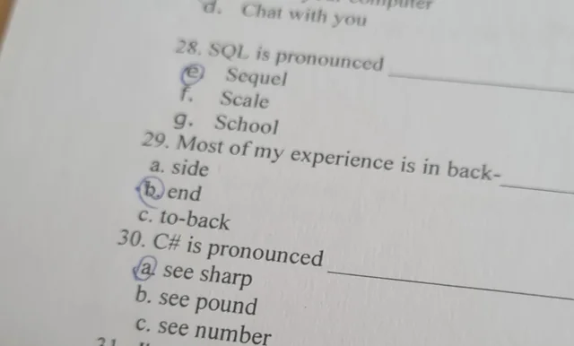

# Milestone 03: The Business Logic

The time has come to implement your first real C# application! 🥳

This and the following Milestones won't introduce new C# features or software engineering techniques but rather allow you to apply the knowledge that you gathered in the previous milestones.

The objectives of this milestone are:

- Implementing the business logic of the banking application

You will find the solutions for this milestone in the [templates folder of Milestone 04](../Milestone04/templates/).

## Task 03-1: Implementing the Business Logic

The business logic of an application is the part that encodes the real-world business rules underlying its features. It is different from other parts of the program that are related to the user interface or low-level database interaction. Previously, you already created diagrams defining the use cases, the workflows, and even the classes of your application.

Reconsider your diagrams. Your task is now to implement the business logic of your program. In our case, this refers to all classes in your class diagram that are not related to the user interface. This time the template only comprises an almost empty C# project. You have to add all the class files and classes yourself. Good luck! 🍀

⚠ __Attention__ ⚠: From now on, the solutions can considerably differ from your solutions if you use diagrams as the starting point for the implementation that differ from the diagrams provided as the solution of the previous milestone. If you are a beginner and have no instructor guiding you, you might consider using the provided diagrams as a starting point. Otherwise, you can't compare your code with the solutions.
