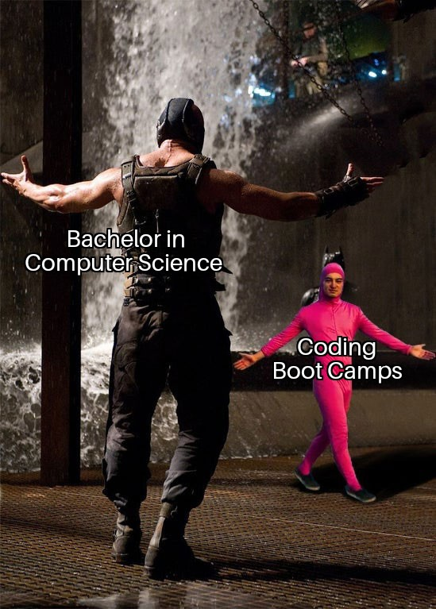

# Milestone 04: The User Interface

You now have a program that implements the business logic of your application. As the final milestone of this crash course, you will now transform it into an interactive application by adding the user interface. Keep on going, you are almost at the finish line! 🚀

The objectives of this milestone are:

- Implementing the user interface of your application

## Task 04-1: Implementing the CLI

Again, have a look at your class diagram and see how the user interface connects to the business logic. Of course, the user interface should be a CLI that you learned to implement in an earlier milestone. When you are done and your program works, read the next and final paragraph.

## Congratulations!

Wow, you really did it! You implemented your first C# application! Great work! 🥳🎉🎊

This marks the end of the crash course! I hope you enjoyed it and learned something useful. As a final surprise have a look at the [Certificate](../other/certificate_csharp_crashcourse.pdf). Feel free to print it out. If you have an instructor ask her or him to sign it. Otherwise, you can also issue the certificate to yourself, because after all, you know you did it, and you did it for yourself to improve, which is the greatest achievement. No signature can change that. 😉

Of course, you are now ready for the real world:

